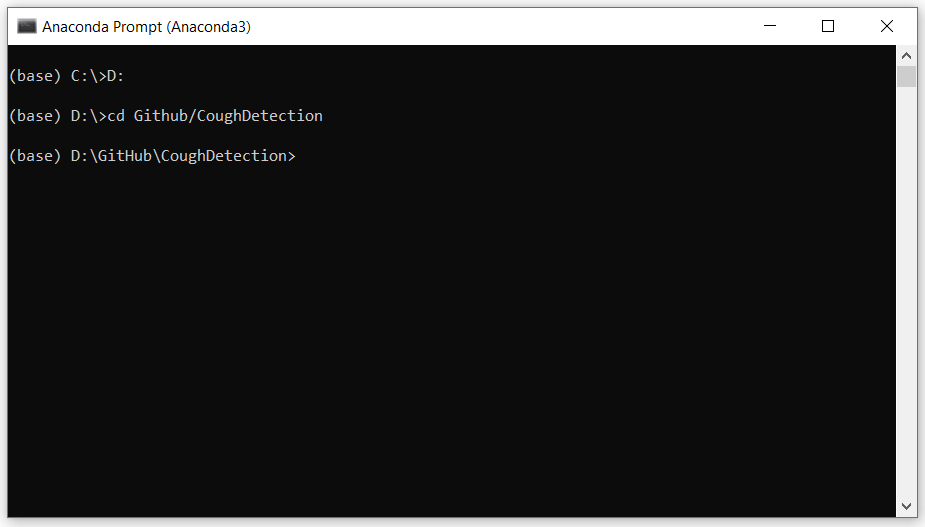
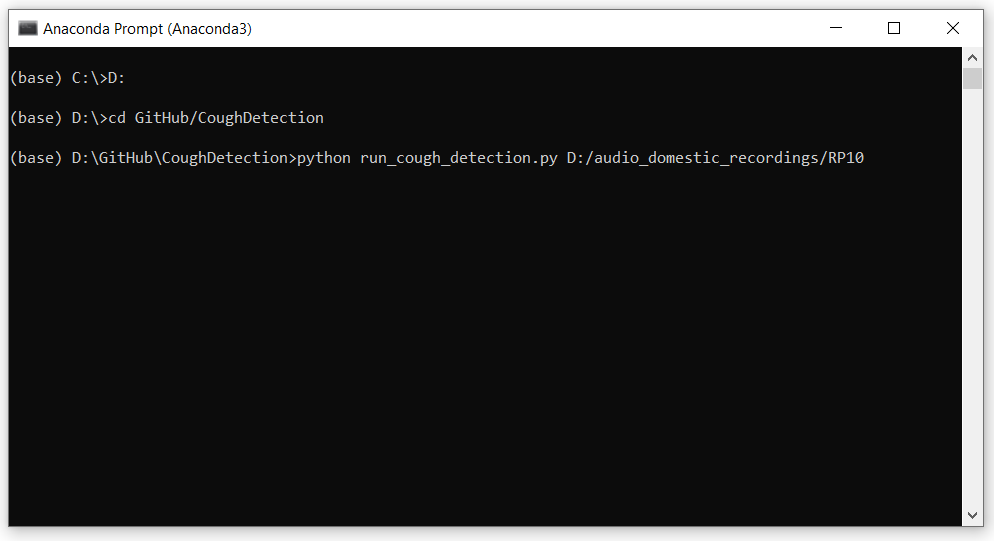
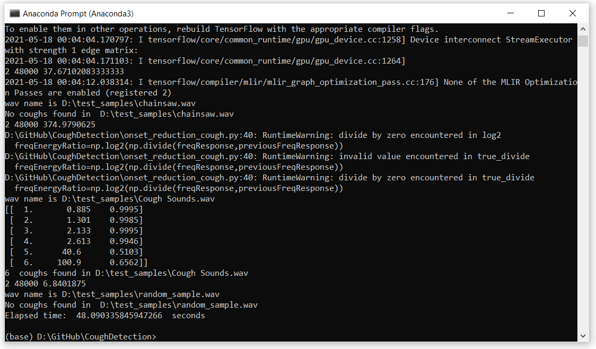
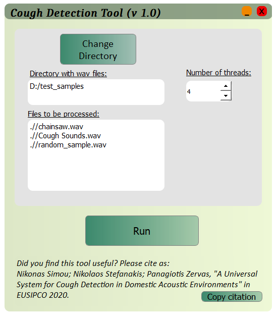
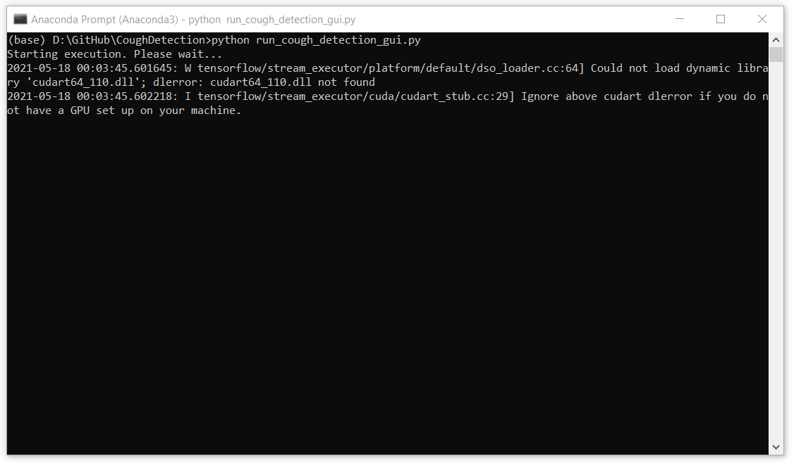
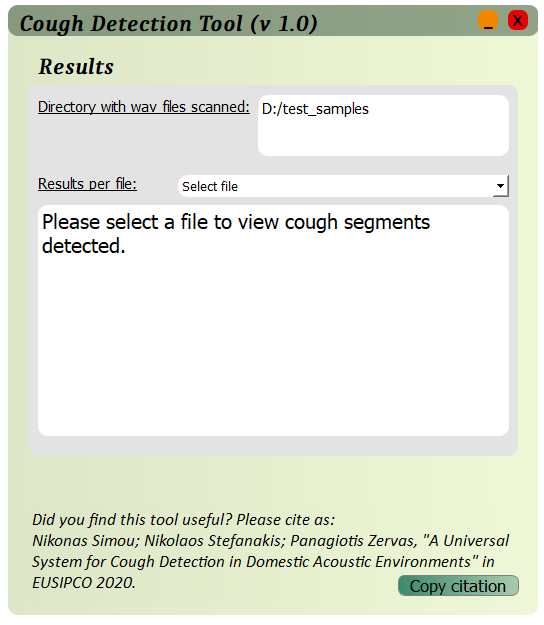
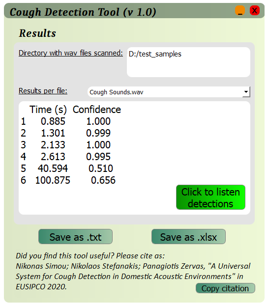
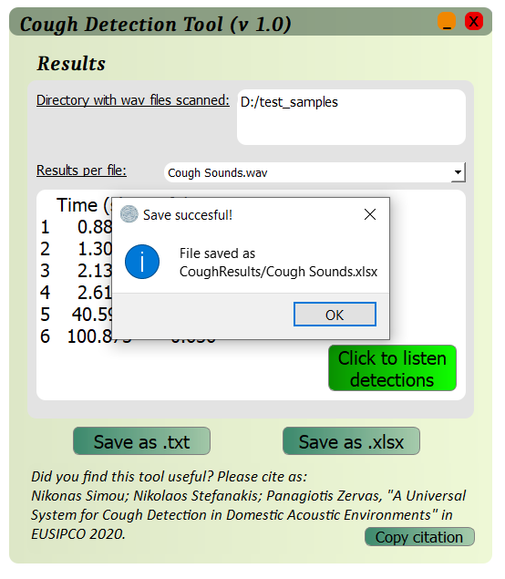
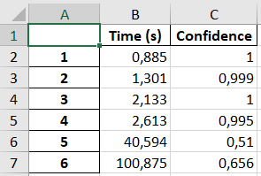
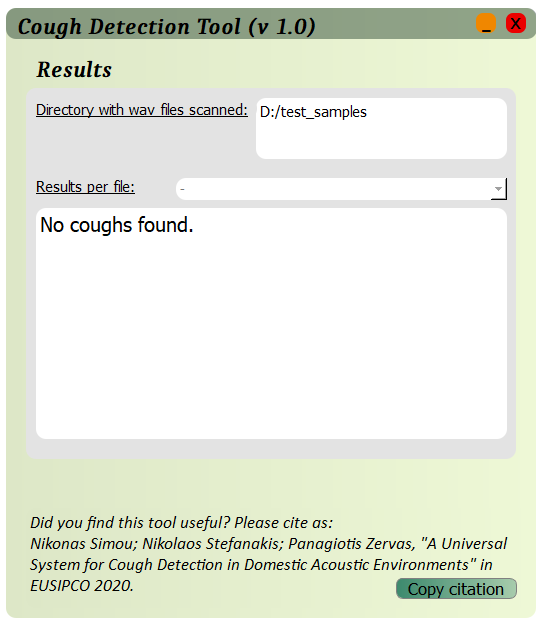

# A Universal System for Cough Detection in Domestic Acoustic Environments
 **Nikonas Simou¹,Nikolaos Stefanakis¹², Konstantinos Psaroulakis¹**
> **¹** FORTH-ICS, Heraklion, Crete, Greece, GR-70013
> 
> **²** Hellenic Mediterranean University, Department of Music Technology and Acoustics, Rethymno, Greece, GR-74100

-----
## Initial setup 
1) Extract the folder containing the source files in any directory of your hard drive.
2) Install [anaconda], by downloading the installer from the official website. (e.g. Anaconda3-2020.02-Windows-x86_64.exe).
After installation, "anaconda prompt" will show up in the program list.
3) Open anaconda prompt and navigate to the folder which contains the code. (e.g. by typing "cd D:/MyDocuments/CoughDetection")
4) In Anaconda prompt type:
    ```sh
    pip install -r requirements.txt
    ```
    in order to install all required libraries.
    This might take some time but it is important for this procedure to be completed 
    successfully.
-----
## Running the algorithm on your data
The system should be ready to run by now. You can run the tool by calling "run_cough_detection.py" function for the command line version or "run_cough_detection_gui.py" for the GUI version.
1) Open anaconda prompt and navigate to the source code.

	

2) 1) Run the command line version by passing as argument the path of the folder which contains the recordings to be analyzed.
For example, if the path is "D:/audio/domestic_recordings", then we can simply type (in anaconda prompt):
	    ```sh
	    python run_cough_detection.py D:/audio/domestic_recordings/
	    ```
	    
	
	
	* The path of the folder which contains the recordings is the only mandatory input argument.
	* An additional parameter is:

	* **Number of threads** to be used. For example, if we want to engage 8 threads, we can type:
        ```sh
        python run_cough_detection.py D:/audio/domestic_recordings/ -t 8
        ```
	
	* After waiting an amount of time a proportionate to the number of input files, execution will be completed and you will see results printed in anaconda prompt. If you finished the analysis, you can quit anaconda prompt. 
	
	
	
   2) Run the graphical version of the tool by running: 
		```sh
		python run_cough_detection_gui.py
		```	
	<!-- -  -->
		
	
	* Click «Select directory» to choose the directory which contains the input files for the algorithm. A file dialog will open and you can navigate through your drives to find desired folder. (Note: Apart from the selected root directory, .wav files from all the subdirectories will also be included.

	* After choosing the desired directory, .wav files that are going to be processed will appear in the text box  «Files to be processed» and button "Run" will be activated. In case you have selected wrong directory, you can change by clicking «Change directory». You can also choose the number of threads to be used for the execution.
	
       

	* After clicking "Run", GUI will disappear and execution continues on command prompt.
	
		
	
	* When execution finishes, GUI will appear again presenting the results. 
	
		
	
	* Click "Select file" to activate the dropdown menu and navigate through results.
		

	* When you select a file, all cough detections in this file will be presented in the followed text box. The three columns correspond to index, onset time, confident (How "sure" was the classifier about this detection). You can listen all cough detections from this wav file (merged) by clicking "Click to listen detections". 
	
	* If you click "Save as .txt", "Save as .xlsx", current showing results will be saved in the corresponding filetype and a message with the directory and the filename of the saved file will pop up.
	
		
	
	* An example of an excel file exported through the tool:
	
		
	
	* In case the following screen appeared after execution of the tool, no cough segments were detected through the analysis.
	
		
	
	

## OUTPUT 

In both command line and GUI version of the tool, the output files are the same.
A folder named `CoughDetections` is created and all results are stored there. For each `.wav` file in the input folder, if one or more coughs are detected:
1. A `.txt` file will be exported which contains each cough instance's timestamp as well as the corresponding level of confidence the classifier has. 
2. Additionaly a `.wav` file containing all the cough detections concatenated, is exported.	
3. In the case of the GUI version, depending on user choices in the last step, output files could be more (e.g. one .xlsx file for each .wav file or extra .txt files for each recording)    
	
-----	  


## License
MIT 

Copyright (c) 2021 **Nikonas Simou, Nikolaos Stefanakis, Konstantinos Psaroulakis**

--------
### How to reference
If you find any of this library useful for your research, please give cite as:
Nikonas Simou; Nikolaos Stefanakis; Panagiotis Zervas, ["A Universal System for Cough Detection in Domestic Acoustic Environments"] in EUSIPCO 2020.


#### Important notes:
1) Tool converts recordings to 16kHz.

2) For long-duration recordings, the tool is configured to use multiple threads. Each thread handles a `maxDur` seconds segment.
The default value for `maxDur` is set to 600 seconds.

3) You can change the onset detector parameters by tweaking the hardcoded values located in the `ClipCoughDetector` class.


 [anaconda]: <https://anaconda.org/>
 ["A Universal System for Cough Detection in Domestic Acoustic Environments"]: <https://ieeexplore.ieee.org/document/9287659>
